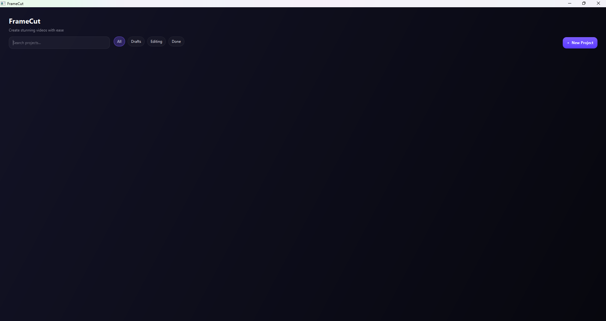
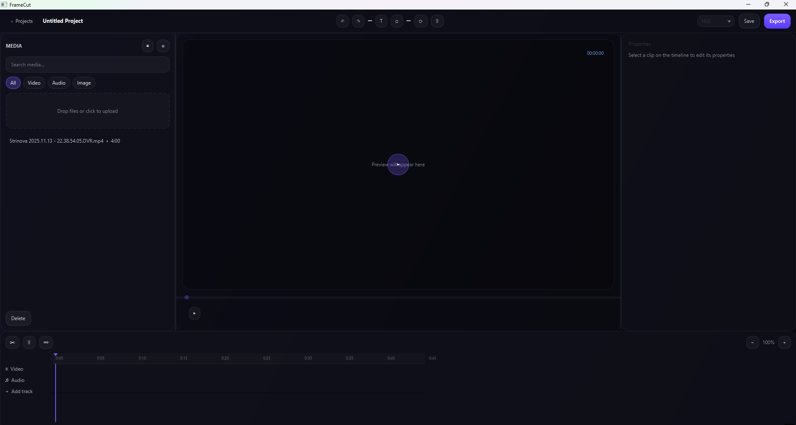

# ClipStudio — JavaFX Video Cutter (MVP)

A lightweight, Clipchamp-style MVP built with **Java 17 + JavaFX**, using **FFmpeg** for cutting/merging and **SQLite** for metadata.  
Videos are stored on disk in a local `media/` vault; the DB stores **paths + metadata** (duration, width/height, createdAt).

https://github.com/2anko/clipstudio

---

## End-User System Requirements

Before running the application, please ensure your system meets the following requirements:

- **Operating System:** Windows (x64)
- **Graphics Card:** An NVIDIA GPU with up-to-date drivers is required for hardware acceleration.
- **VLC Media Player:** The 64-bit version of VLC must be installed. It can be downloaded from [https://www.videolan.org/](https://www.videolan.org/).
- **FFmpeg:** The 64-bit version of FFmpeg must be installed and accessible from the system's PATH. It can be downloaded from [https://ffmpeg.org/](https://ffmpeg.org/).

## Building from Source

To build the application from source and create a Windows `.exe` installer, you will need the following development tools:

1.  **A JDK (version 14 or newer):** This is required for the `jpackage` tool.
2.  **The WiX Toolset (version 3.0 or newer):** Download it from [https://wixtoolset.org/](https://wixtoolset.org/).

All Java dependencies are managed by Gradle and are listed in the `build.gradle` file. Once you have the prerequisites, you can build the installer by running the following command in your terminal:

```bash
gradlew jpackage
```

The installer will be located in the `build/jpackage` directory.

## Running the Application

After you have built and run the installer, you can launch the application from the Start Menu or the desktop shortcut. Please make sure you have VLC and FFmpeg installed before running the application for the first time.

---

## Features (current)

- 🎞️ **Library**: import MP4 files (drag & drop or button). Stored in `media/`, path + metadata saved in SQLite.
- ➕ **Add to timeline**: double-click, **Enter**, or **Add → Timeline** (multi-select supported).
- ✂️ **Trim**: two-thumb range bar with smooth dragging.
- ▶️ **Preview**: plays only within the trimmed range (stops at end handle).
- 🔗 **Merge**: export concatenates trimmed clips using FFmpeg concat demuxer (stream copy by default).
- 🗑️ **Delete from DB**: removes selected assets from DB and deletes files in `media/`; timeline clips referencing them are cleared.

> Roadmap ideas: reordering clips, thumbnails/waveforms, zoomable ruler, frame-accurate cuts, progress dialog, project save/load.

---

## Screenshots


